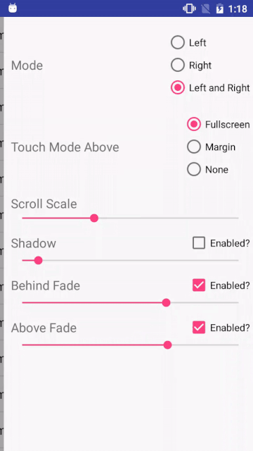

SlidingMenu
=======
SlidingMenu is an Open Source Android library that allows developers to easily create applications with sliding menus like those made popular in the Google+, YouTube, and Facebook apps.

ScreenShot
--------
 

Simple Example
--------
```java
public class SlidingExample extends Activity {

    @Override
    public void onCreate(Bundle savedInstanceState) {
        super.onCreate(savedInstanceState);
        setTitle(R.string.attach);

        // set the content view
        setContentView(R.layout.content);

        // configure the SlidingMenu
        SlidingMenu menu = new SlidingMenu(this);
        menu.setAboveFadeEnabled(true);
        menu.setAboveFadeDegree(0.35f);
        menu.setShadowWidthRes(R.dimen.shadow_width);
        menu.setShadowDrawable(R.drawable.shadow);
        menu.setBehindOffsetRes(R.dimen.slidingmenu_offset);
        menu.setBehindFadeEnabled(false);
        menu.setBehindFadeDegree(0.35f);
        menu.setTouchModeAbove(SlidingMenu.TOUCH_MODE_FULLSCREEN);
        menu.setTouchModeBehind(SlidingMenu.TOUCH_MODE_FULLSCREEN);

    }

}
```

DownLoad
--------
```groovy
compile 'com.github.ShortStickBoy:SlidingMenu:V1.0.0'
```

License
=======

    Copyright 2017 sunzn

    Licensed under the Apache License, Version 2.0 (the "License");
    you may not use this file except in compliance with the License.
    You may obtain a copy of the License at

       http://www.apache.org/licenses/LICENSE-2.0

    Unless required by applicable law or agreed to in writing, software
    distributed under the License is distributed on an "AS IS" BASIS,
    WITHOUT WARRANTIES OR CONDITIONS OF ANY KIND, either express or implied.
    See the License for the specific language governing permissions and
    limitations under the License.